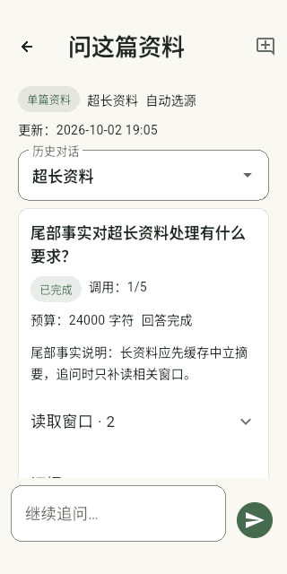
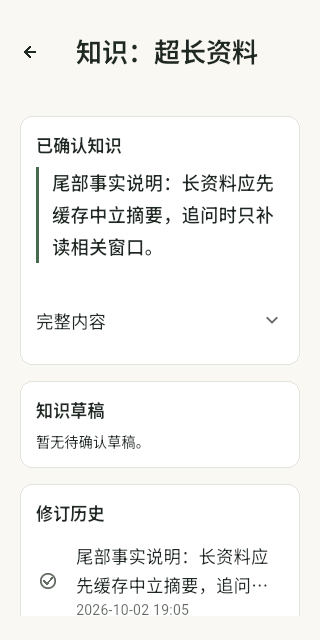

# 知识对话与长资料验证记录

验证日期：2026-10-02。功能分支：`feat/knowledge-dialogue`。基线为 `04f7e6a`，应用版本保持 `0.3.1+4`；未发布、推送或合并 main。

## 本轮实现

- 长文本和 PDF 形成只依赖原始来源的中立分段摘要，持久缓存后层次合并，重复分析复用有效缓存；原文完整保留，全文检索包含超长段落尾部。
- 阅读、主题和研究页提供持久化对话，按问题提供窗口并允许有限补读文本、PDF 和图片，展示调用预算、阶段、证据及暂停重试。
- 新来源及对话产生待确认知识提案，审阅、编辑和接受后创建独立知识修订；检查基础版本与全部实际依赖，保存失败不发布半成品。旧自动综述继续独立保留。
- 交互及后台各一条通道；HTTP 整体超时、取消、上下文和媒体预算均有守卫。AppData v4 / RuntimeState v2 兼容旧版本，恢复在途会话不自动重发。

详细约束见 [需求设计](superpowers/specs/2026-10-02-knowledge-dialogue-design.md) 和 [实施计划](superpowers/plans/2026-10-02-knowledge-dialogue.md)。没有新增或升级依赖。

## 检查与结果

实际环境：Flutter 3.47.5、Dart 3.13.4、Android SDK 36、JDK 21.0.12.1。设备为隔离 Android API 36 arm64 模拟器，画面 320 × 640。

| 检查 | 结果 |
| --- | --- |
| `bash tool/check.sh android` | 通过：格式检查 94 文件无变化，静态分析无问题，13 个 Git 钩子场景，365 项单元／Widget 测试，arm64 release APK 构建 |
| `flutter test integration_test/knowledge_dialogue_device_test.dart -d emulator-5554 --no-pub --no-uninstall` | 通过，1 个完整设备流程；本地 HTTP、真实 SQLite、文件、原生桥接与渲染 |
| `git diff --check` | 通过 |
| 独立代码审查及 Kotlin 增量复核 | 通过，无遗留高／中等级问题 |

设备流程使用 34703 字符资料，首次形成 22 次分段摘要请求，再次分析仍为 22 次，证明有效缓存被复用。尾部引用窗口为 UTF-16 偏移 34250–34703，答案保留实际窗口 ID。知识提案接受后可在知识页和修订历史读取。

实际 PDF 渲染及对话保留第 1 页、原附件 SHA256 和未精确文字核验标记。独立 PNG 归一化为 774 字节，原文件字节保持不变；非对称四色 EXIF 5／7 图像的方向与尺寸断言通过。备份恢复的在途轮次为 `interrupted`，保留 `requestPending`，不生成自动重发任务。

已直接查看设备截图：对话预算、回答、范围和底部输入区可见；已确认知识、草稿和修订历史可见。小屏、1.8 倍字体、键盘及状态保留另有 Widget 测试。

| 对话页面 | 已确认知识 |
| --- | --- |
|  |  |

## 审查修复与回归

- 提案基础版本在请求前冻结，避免请求期间知识更新被绑定成错误基础。
- 明确来源范围并继承知识及历史的完整祖先，继承视觉附件指纹；移除接受修订的自身依赖，避免新修订立即失效。
- 实际送入请求的基础知识不可因预算被裁掉后继续覆盖；提供窗口 ID、附件指纹与 PDF 页码的证据匹配。
- 修复暂停重试、提交错误反馈、精确会话通知导航和旧综述展示；长文切分不会拆开 UTF-16 代理对。
- 修复 EXIF 5／7 方向互换，并通过真实原生设备夹具；恢复会话时拒绝不合法调用数和文字预算，红测先复现后修复。

完整检查与构建按顺序运行，避免测试插件注册文件与 release 构建并发生成。首次设备测试遇到 Flutter VM 发现等待，停止该次测试后重跑通过；成功流程又以保留应用数据方式运行并提取截图。最终 release 构建在设备测试之后完成。

## 实测边界

请求由专用设备内的确定性本地服务响应，未使用个人生产配置或真实供应商 Key。夹具证明业务和协议路径，不证明真实模型的摘要质量、回答质量、usage、长期效果或耗时改善。90 秒整体时限、慢响应取消、预算及并发隔离由受控行为测试验证。首版回答一次性显示；iOS／macOS 和实体手机未构建验收。

APK、原始日志和设备记录留在忽略目录，不进入 Git。保留用户已有两份未跟踪研究文档。
