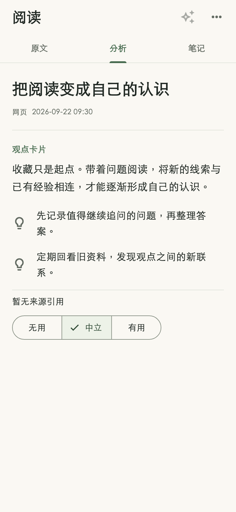
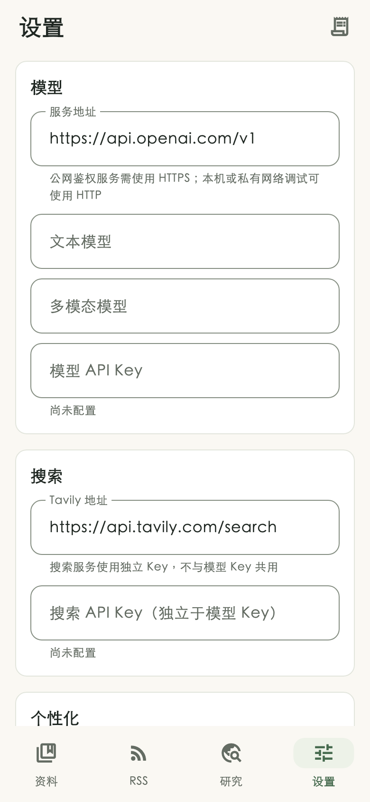

# 视觉细化与验证记录

本轮在独立 worktree、`feat/visual-refinement` 分支实现，基线为 `ba3ce4e`。保留暖白 #FAF8F3、深绿 #476B4F、系统无衬线与 12dp 控件，未添加依赖或改变存储、研究授权、资料生命周期行为。

## 变化

- `lib/ui/common.dart`：统一文字层级、辅助文字、标签、导航和页签；输入框提供清晰的默认边界和深绿焦点边界；空状态增加图形容器与阅读宽度限制。
- `lib/ui/library_page.dart`：范围筛选与状态筛选区分强调程度，统一左边线和行距，展示当前结果数量与排序说明，突出未读信息。
- `lib/ui/item_detail.dart`：拉开文章标题、类型/日期与正文层级，增加阅读起点分隔，保留原文、分析、笔记交互。
- `lib/ui/rss_page.dart`、`lib/ui/research_page.dart`：统一分组标题层级和间距。
- `test/v2_ui_test.dart`：新增筛选计数、键盘下笔记保存；三种宽度分别覆盖空页面和有内容页面；键盘场景通过实际往返滚动验证结果、搜索和空状态可达。

## 实际验证

环境：Flutter 3.47.5 / Dart 3.13.4，macOS。本地锁定依赖离线解析成功，`pubspec.lock` 未改变。

- 改动前 `flutter test --no-pub test/v2_ui_test.dart test/library_status_test.dart`：12 项通过。
- 最终 `FLUTTER_BIN=<SDK>/bin/flutter bash tool/check.sh full`：通过。包括 Shell 语法、36 个 Dart 文件格式检查、Flutter 静态分析（无问题）、Git 钩子行为测试及 **138 项单元/Widget 测试**。
- 覆盖宽度 320 / 390 / 430、1.8 倍文字、320×640 下 300px 键盘遮挡、搜索焦点保持、批量管理、状态保留和笔记保存。
- 独立 code-reviewer 审查通过。发现的输入边界低对比度已修复为 `outline` #858E82；对白底对比度约 3.39:1。
- 初次 full 的旧键盘测试假定离屏控件已被构建；现改为对主列表真实滚动，原点击可达、焦点及业务断言保留。独立审查确认修正合理，最终 full 全部通过。
- Flutter Widget 渲染截图生成测试通过，已目视检查资料、阅读、RSS、研究、设置、空状态与大字体截图。精选图见下方。

## 预览与限制

截图使用受控示例资料，在 Flutter 测试渲染器加载本机中文字体后生成；这不是 Android 设备截图，实际设备字体和系统栏可能不同。截图脚本及完整预览保留在该 worktree 被忽略的 `dist/visual_preview_test.dart` 和 `dist/visual/`。

本次没有连接 Android 设备，未执行设备验证或 Android APK 构建；本轮无原生/平台改动，也不涉及发布或真实模型/搜索供应商验证。

| 资料列表 · 390 | 阅读分析 · 390 |
| --- | --- |
|  |  |

| 大字体 · 320 / 1.8× | 设置 · 390 |
| --- | --- |
|  |  |
