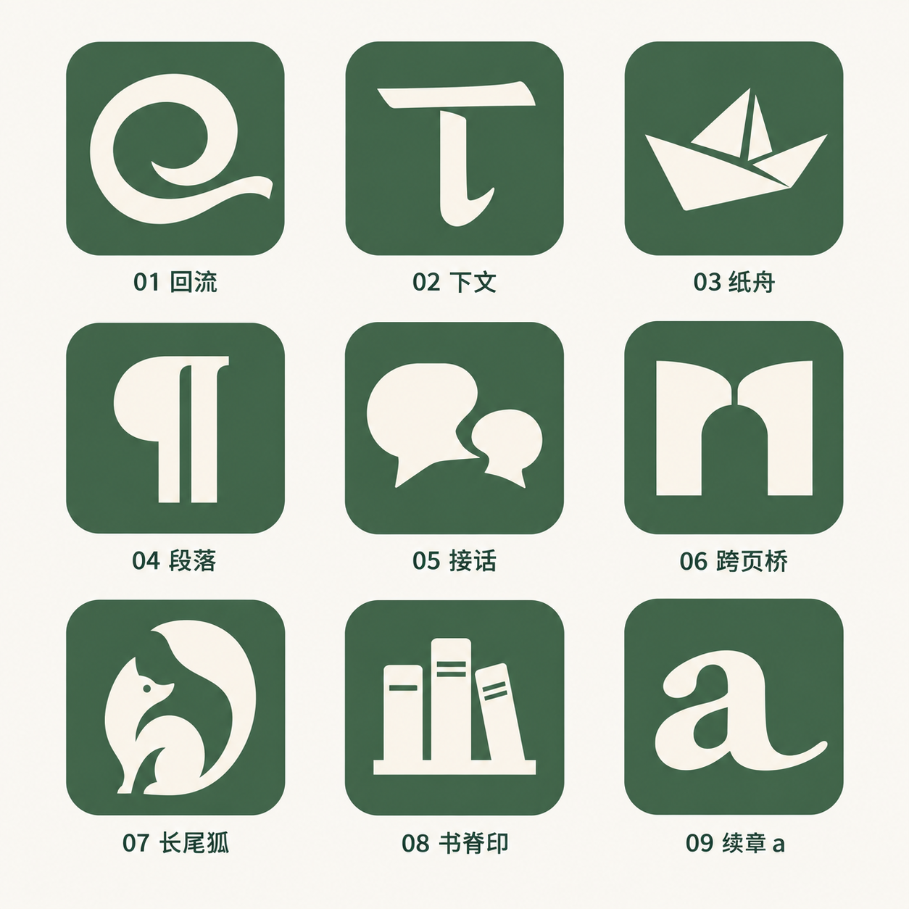

# 有下文 · Afterword 图标设计

## 已选方向：长尾狐

已按第 07 号方向制作 [长尾狐设计包](fox-kit/README.md)：功能 SVG、狐狸场景与可控制的动效。[打开离线样册](fox-kit/index.html)。设计包交付记录仍作为历史；当前 `feat/fox-app-integration` 正在把长尾狐套件接入 Flutter/Android，详见 [App 接入记录](APP_INTEGRATION.md)。

## 第二轮：九宫格方案对比

按从左到右、从上到下编号：

| 第一列 | 第二列 | 第三列 |
| --- | --- | --- |
| 01 回流：返回旧想法并继续延伸 | 02 下文：从「下」字出发的字标 | 03 纸舟：阅读带来的探索 |
| 04 段落：出版与编辑符号 | 05 接话：想法之间的回应 | 06 跨页桥：从书页通向下一步 |
| 07 长尾狐：好奇、灵巧的角色 | 08 书脊印：个人资料库 | 09 续章 a：Afterword 字母标志 |

本轮由内置 imagegen 生成一张含九个方案的对比板，统一底色、尺寸与视觉重量，供选择方向；当时尚未替换 App 图标。[本轮完整提示词](afterword-icon-grid-v2-prompt.txt)。

## 方案一：翻页的书签

书签表示收藏，右上角翻起的书页表示继续阅读和探索，呼应「让每一次收藏，都有下文」。保留一个主要轮廓，用较宽的留白表现翻页。

- 配色参考现有应用主题：深绿 `#476B4F`、暖白 `#FAF8F3`。
- 图形不含文字，便于在桌面图标中辨认；四周留出空间，便于后续适配圆形与圆角方形遮罩。
- 本文件为图标设计稿，尚未替换平台启动图标。发布前需制作各平台尺寸与 Android 自适应／单色资源，并在桌面实际核对效果。
- 使用内置 imagegen 生成；[最终生成提示词](afterword-icon-v1-prompt.txt)随稿保存。PNG 为生成图像，正式矢量轮廓和精确色值需在资源制作阶段核对。

日期：2026-09-27。
